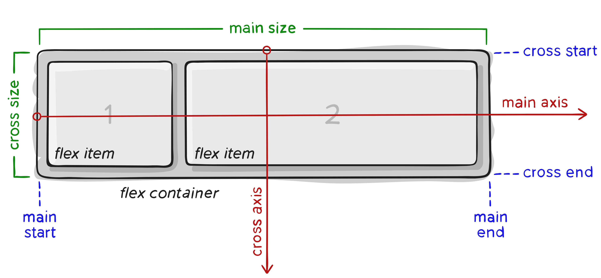
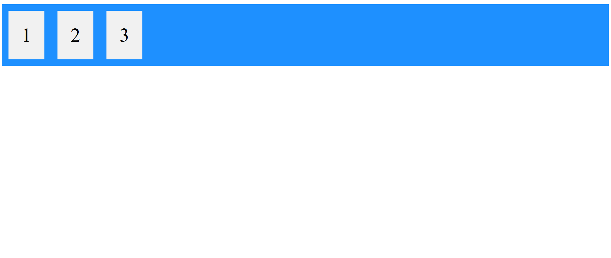

# CSS, flexbox

---

## CSS (Cascading Style Sheets)
 - CSS je jazyk navržený standardizační organizací W3C, který lze použít k popisu vzhledu a formátování HTML, resp. XHTML či XML, elementů pro zobrazení v prohlížeči
 - Jeho syntaxe se skládá z deklarace elementu a pravidel pro jeho zobrazení
 ```css
 body{
    background-color: yellow; 
    color: black;
    text-align: center;
    padding: 10px !important; /*!important zvýší "důležitost" pravidla*/
 }
 ```
 ---

 ## Výhody CSS
 - Přehlednost kódu díky oddělené stylové části od obsahu
 - Snadná změna stylu
 - Standardizovaný vzhled pro celý náš web

 ---

 ## Flexbox
 - Motivace: lehčí práce s layouty, než doposud byla možná s `float` a `inline-block` a snadné vytváření "liquid layouts" pro různé velikosti obrazovek
 - **Flexbox** (CSS Flexible Box Layout Module) je layoutová metoda pro uspořádání prvků v sloupcích a řádcích
 - Hlavní výhoda: změní velikost svých prvků aby co nejlépe zaplnil volné místo
 - Modernější varianty: Bootstrap Grid, Flexbox Grid
 
 ---

 ## Komponenty a osy flexboxu
 - flex container - parent element, který v sobě drží všechny flex item, při použití `display` z CSS může být definován buď jako `flex` či `inline-flex`
 - flex item - každý child element flex container se považuje za flex item
 - axes - každý flex box má dvě osy: main a cross
 
 
 ---

 ## Důležité vlastnosti
 - `flex-direction` - definuje hlavní osu a směr pro vkládání prvků do kontejneru, může být `row`, `row-reverse`, `column` nebo `column-reverse`
 - `flex-wrap` - nastaví jestli musí být flex itemy nutně na jednom řádku nebo jestli se můžou zalamovat na více řádků, může být `nowrap` pro vynucení jednoho řádku, `wrap` nebo `wrap-reverse`
 - `justify-items` - nastaví výchozí `justify-self` pro všechny flex itemy, ovládá zarovnání všech položek podél main osy
 - `align-items` - nastaví výchozí `align-self` pro všechny flex itemy, ovládá zarovnání všech položek podél cross osy

 ---

 ## Příklad - flex container se 3 flex itemy
 ```html
<!DOCTYPE html>
<html>
<head>
<style>
.flex-container {
  display: flex;
  background-color: DodgerBlue;
}

.flex-container > div {
  background-color: #f1f1f1;
  margin: 10px;
  padding: 20px;
  font-size: 30px;
}
</style>
</head>
<body>
	<div class="flex-container">
  		<div>1</div>
  		<div>2</div>
  		<div>3</div>  
	</div>
</body>
</html>
 ```

 ---

 ## Vizualizace příkladu
 - Vizualizace předchozího slidu po spuštění kódu:


 ---
 
 ## Zdroje
 - https://developer.mozilla.org/en-US/docs/Web/CSS/
 - https://www.w3schools.com/css/css3_flexbox.asp
 - https://css-tricks.com/snippets/css/a-guide-to-flexbox/
 - https://www.itnetwork.cz/html-css/responzivni-webdesign/html-css-flexbox-tutorial-tvorba-modernich-layoutu